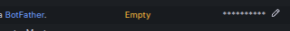
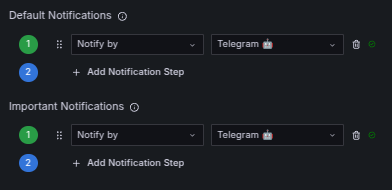
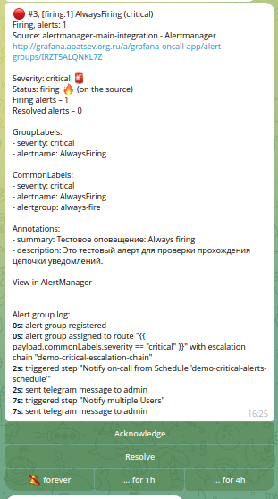

## Введение

Эффективный мониторинг является краеугольным камнем надежности любой IT-системы, позволяя своевременно выявлять возникающие проблемы. Однако само по себе обнаружение проблемы – это лишь полдела. Не менее важна быстрая и скоординированная реакция команды. Инструменты вроде Alertmanager и Grafana OnCall играют ключевую роль в автоматизации процесса оповещения и управления инцидентами. В этой статье мы подробно рассмотрим, как выстроить цепочку взаимодействия между различными компонентами системы мониторинга и оповещения, чтобы каждый инцидент автоматически отслеживался от момента его фиксации правилом мониторинга до доставки уведомления ответственному инженеру в мессенджер, например, Telegram.

## Преимущества маршрутизации алертов через Grafana OnCall

На первый взгляд, может показаться достаточным отправлять алерты напрямую из Alertmanager в Telegram. Однако такой подход сопряжен с рядом существенных недостатков. Уведомления, как правило, приходят в общий чат или одновременно нескольким сотрудникам. Это создает неудобства при сменных дежурствах и может привести к размыванию ответственности: когда оповещение видят все, возникает риск, что никто конкретно не возьмет на себя его обработку. Кроме того, отсутствует удобный механизм контроля за тем, кто в данный момент является ответственным дежурным, сложно разграничить рабочие и нерабочие часы для разных сотрудников, а также практически невозможно эффективно управлять графиками дежурств и эскалациями.

Использование Grafana OnCall в качестве промежуточного звена между Alertmanager и конечным каналом оповещения (в нашем случае Telegram) предоставляет значительные преимущества:

1.  **Управление расписаниями дежурств:** Grafana OnCall позволяет гибко настраивать графики дежурств. Вы указываете, кто и когда находится на смене, и только этот сотрудник (или группа сотрудников) получит уведомление.
2.  **Механизм эскалации:** Если дежурный инженер не отреагировал на алерт в течение заданного времени, Grafana OnCall автоматически эскалирует его следующему по цепочке ответственному лицу или целой группе. Это гарантирует, что инцидент не останется без внимания.
3.  **Подтверждение алертов (Acknowledgement):** Дежурный может подтвердить получение алерта прямо из интерфейса OnCall или через интегрированные инструменты (например, Telegram-бот). Это дает понимание остальной команде, что проблема взята в работу.
4.  **Централизованное управление:** Все алерты, их статусы, история и ответственные лица агрегируются в одном месте, обеспечивая прозрачность процесса.

Таким образом, выстраивание цепочки оповещений по схеме `Alertmanager → Grafana OnCall → Telegram` обеспечивает централизованный, управляемый и прозрачный процесс реагирования на инциденты. Этот подход автоматизирует учёт дежурств, поддерживает многоуровневую эскалацию и позволяет отслеживать подтверждение обработки алертов, что критически важно для минимизации времени простоя и оперативного устранения неисправностей.

## Общая схема прохождения алерта

Для наглядности представим путь, который проходит алерт от момента его генерации до получения уведомления конечным пользователем.

### Диаграмма прохождения алерта

```
Prometheus Rule → vmalert → Alertmanager → Grafana OnCall → Telegram
```

Эта диаграмма иллюстрирует последовательность шагов:

1.  **Система мониторинга** (например, VictoriaMetrics или Prometheus) непрерывно собирает метрики.
2.  **Механизм оценки правил** (например, `vmalert` для VictoriaMetrics или встроенный в Prometheus) периодически вычисляет выражения, заданные в правилах алертинга (alerting rules).
3.  При срабатывании условия правила генерируется алерт и отправляется в **Alertmanager**.
4.  **Alertmanager** выполняет дедупликацию, группировку, сайленсинг (подавление) и маршрутизацию алертов согласно своей конфигурации. Затем он пересылает их настроенным получателям, одним из которых в нашей схеме является Grafana OnCall.
5.  **Grafana OnCall** получает алерт, обрабатывает его согласно настроенным расписаниям дежурств, правилам эскалации и маршрутам.
6.  Наконец, **Grafana OnCall** отправляет уведомление через выбранный **канал** (в нашем случае Telegram) назначенному дежурному инженеру.

Эта цепочка обеспечивает, что алерт не потеряется и будет доставлен нужному человеку в нужное время.

## VMAlert: обработка и маршрутизация алертов

### Что такое VMAlert

**VMAlert** — это один из ключевых компонентов стека мониторинга VictoriaMetrics. Его основная задача – это оценка правил алертинга (alerting rules), написанных в стиле Prometheus, и генерация на их основе алертов. VMAlert работает следующим образом: он загружает конфигурационные файлы с правилами, периодически опрашивает указанные источники метрик (обычно это кластер VictoriaMetrics или любой другой Prometheus-совместимый источник данных), вычисляет заданные в правилах выражения (PromQL-запросы) и, если условие срабатывает (выражение возвращает результат), формирует событие алерта. После этого VMAlert направляет эти алерты в настроенный экземпляр Alertmanager для дальнейшей обработки: группировки, подавления, маршрутизации и отправки уведомлений.

### Архитектура решения с VMAlert

В рассматриваемой архитектуре для сбора и хранения метрик мы используем VictoriaMetrics, а за оценку правил алертинга отвечает её компонент `vmalert`. Процесс выглядит так:

1.  **Создание Alert Rule:** Инженер определяет условия, при которых система должна генерировать оповещение, и описывает их в виде правила (alert rule) в формате, совместимом с Prometheus.
2.  **Применение правила к VMAlert:** Это правило загружается в `vmalert`.
3.  **Генерация алерта:** `vmalert` регулярно выполняет запросы к VictoriaMetrics, проверяя условия, заданные в правилах. Как только условие одного из правил выполняется (например, загрузка CPU превышает 90% в течение 5 минут), `vmalert` генерирует алерт.
4.  **Отправка в Alertmanager:** Сгенерированный алерт немедленно отправляется в Alertmanager.
5.  **Обработка в Alertmanager:** Alertmanager, получив алерт, применяет к нему свои правила: группирует похожие алерты, чтобы избежать "шторма" уведомлений, подавляет известные или некритичные алерты (silencing), и, что самое важное для нашей схемы, маршрутизирует его дальше.
6.  **Передача в Grafana OnCall:** Согласно конфигурации Alertmanager, алерт перенаправляется в Grafana OnCall.
7.  **Обработка в Grafana OnCall:** Grafana OnCall принимает алерт и начинает действовать согласно своим настройкам: определяет текущего дежурного по расписанию, учитывает настроенные каналы связи (Telegram, Slack, SMS, звонки и т.д.) и применяет логику эскалации, если первый дежурный не реагирует.
8.  **Уведомление в Telegram:** После всех этапов обработки в OnCall, уведомление отправляется ответственному сотруднику через Telegram (или другой настроенный канал).

Такой многоступенчатый подход обеспечивает максимальную гибкость и надежность системы оповещений. Каждый компонент выполняет свою специализированную задачу, позволяя тонко настроить весь процесс реагирования на инциденты – от фильтрации и маршрутизации до эскалации и доставки уведомлений точно по адресу.

## Предпосылки: Настроенный Kubernetes Кластер

В данной статье предполагается, что у вас уже есть работающий Kubernetes кластер. Все описываемые компоненты (VictoriaMetrics, Alertmanager, Grafana OnCall, Grafana) будут разворачиваться в этом кластере с использованием Helm-чартов.

Но вы можете установить kubernetes через terraform:

```shell
git clone https://github.com/patsevanton/victoriametrics-alertmanager-grafana-oncall-telegram
export YC_FOLDER_ID='ваш folder_id'
terraform init
terraform apply
```

## Установка Prometheus Operator CRDs

Многие правила алертинга для Kubernetes-экосистемы и приложений, работающих в нем, исторически создавались и распространялись в формате Custom Resource Definitions (CRDs) для Prometheus Operator. Эти CRDs, в частности `PrometheusRule`, позволяют декларативно описывать правила алертинга как Kubernetes-ресурсы. Поэтому тестовый алерт сделаем в формате `PrometheusRule`. Чтобы `vmalert` (или Prometheus) мог корректно сконвертировать эти правила в собственный формат VMRule, необходимо установить соответствующие CRDs в ваш кластер.

Выполните следующие команды для добавления репозитория Prometheus Community и установки CRDs:

```shell
helm repo add prometheus-community https://prometheus-community.github.io/helm-charts
helm repo update
helm upgrade --install --wait prometheus-operator-crds prometheus-community/prometheus-operator-crds --version 20.0.0
```

## Особенность интеграции Telegram c Grafana OnCall: Публичный доступ по HTTPS

Важным требованием для корректной работы двусторонней интеграции Grafana OnCall с Telegram (особенно для функций, требующих ответа от Telegram, например, при использовании команд в боте) является доступность вашего экземпляра Grafana OnCall из сети Интернет по протоколу HTTPS. Telegram-серверы должны иметь возможность отправлять обратно запросы (webhook callbacks) на ваш OnCall.

Если вы разворачиваете Grafana OnCall в Kubernetes, для обеспечения внешнего доступа обычно используется Ingress-контроллер и Cert-Manager для автоматического выпуска и обновления SSL/TLS сертификатов (например, от Let's Encrypt).

Пример конфигурации Ingress в Helm-чарте для Grafana OnCall может выглядеть следующим образом (фрагмент `values.yaml`):

```yaml
ingress:
  annotations:
    cert-manager.io/issuer: "letsencrypt-prod"
    kubernetes.io/ingress.class: nginx
```

## Установка Grafana OnCall с использованием Helm-чарта

Grafana OnCall удобно устанавливать и управлять с помощью официального Helm-чарта.

1.  Добавьте репозиторий Grafana:
    ```shell
    helm repo add grafana https://grafana.github.io/helm-charts
    helm repo update
    ```

2.  Создайте файл `oncall-values.yaml` с необходимой конфигурацией для вашего развертывания. Минимально он может быть пустым, если вас устраивают значения по умолчанию, но для продуктивного использования потребуется настройка базы данных, интеграций и т.д.

3.  Установите или обновите Grafana OnCall:
    ```shell
    helm upgrade --install --wait \
        oncall grafana/oncall \
        --namespace oncall --create-namespace \
        --version 1.3.62 \
        --values oncall-values.yaml
    ```

## Установка victoria-metrics-k8s-stack

Для сбора метрик, их хранения и оценки правил алертинга мы будем использовать `victoria-metrics-k8s-stack`. Это комплексный Helm-чарт, который разворачивает все необходимые компоненты VictoriaMetrics, включая `vmalert` и `vmagent`, а также преднастроенный Alertmanager и Grafana.

1.  Добавьте репозиторий VictoriaMetrics:
    ```shell
    helm repo add vm https://victoriametrics.github.io/helm-charts/
    helm repo update
    ```

2.  Создайте файл `vmks-values.yaml` с вашей конфигурацией. Важной частью этой конфигурации будет настройка Alertmanager для отправки алертов в Grafana OnCall (подробнее об этом ниже).

3.  Установите или обновите `victoria-metrics-k8s-stack`:
    ```shell
    helm upgrade --install --wait \
        vmks vm/victoria-metrics-k8s-stack \
        --namespace vmks --create-namespace \
        --version 0.46.0 \
        --values vmks-values.yaml
    ```

### Создание тестового правила алертинга

Чтобы проверить всю настроенную цепочку от генерации алерта до получения уведомления в Telegram, полезно создать простое правило, которое будет срабатывать всегда. Это позволит убедиться, что все компоненты взаимодействуют корректно.

Создадим YAML-файл `alert-always-fire.yaml` со следующим содержимым:

```yaml
apiVersion: monitoring.coreos.com/v1
kind: PrometheusRule
metadata:
  name: alert-always-fire
  labels:
    prometheus: k8s
    role: alert-rules
spec:
  groups:
    - name: always-fire
      rules:
        - alert: AlwaysFiringTest
          expr: vector(1) # Выражение, которое всегда истинно
          for: 1m # Алерт перейдет в состояние 'firing' через 1 минуту
          labels:
            severity: critical
          annotations:
            summary: "Тестовое оповещение: AlwaysFiringTest"
            description: "Это тестовое правило для проверки сквозной работоспособности цепочки уведомлений: vmalert -> Alertmanager -> Grafana OnCall -> Telegram."
```

Примените это правило в вашем Kubernetes кластере:

```shell
kubectl apply -f alert-always-fire.yaml
```

Это правило, основанное на выражении `vector(1)`, будет всегда активным. Мы задаем задержку `for: 1m`, после которой алерт перейдет в состояние `firing`. Метки (labels) и аннотации (annotations) помогут идентифицировать это тестовое оповещение при его просмотре в Grafana, Alertmanager, Grafana OnCall или в сообщении Telegram.

## Установка и настройка плагина Grafana OnCall в Grafana

Если вы используете Grafana, поставляемую в составе `victoria-metrics-k8s-stack` или отдельный экземпляр Grafana, вам потребуется установить и настроить плагин Grafana OnCall для удобного управления расписаниями, эскалациями и интеграциями непосредственно из интерфейса Grafana.

Предположим, ваша Grafana доступна по адресу, например, `http://grafana.vmks.svc.cluster.local` (внутренний адрес) или внешнему адресу, если он настроен. В статье упоминался `http://grafana.apatsev.org.ru` - используйте ваш актуальный адрес.

1.  **Получение пароля для пользователя `admin` в Grafana (если используется из `vmks`):**
    ```shell
    kubectl get secret vmks-grafana -n vmks -o jsonpath='{.data.admin-password}' | base64 --decode
    echo # Добавляем перенос строки для лучшей читаемости
    ```

2.  **Настройка плагина Grafana OnCall через UI Grafana:**
    Мне удалось настроить OnCall плагин только через UI. В конце будут приведены разные ошибки при попытке настройке Oncall плагина. Итак, для настройки плагина OnCall через UI необходимо:
   *   Откройте веб-интерфейс Grafana.
   *   Перейдите в раздел `Administration` -> `Plugins`.
   *   Найдите плагин `Grafana OnCall`. Если он не установлен, установите его.
   *   Перейдите на вкладку `Configuration` для плагина Grafana OnCall.
   *   В поле `OnCall instance URL` (или аналогичном) укажите внутренний адрес вашего Grafana OnCall API. Обычно это сервис Kubernetes, например: `http://oncall-engine.oncall.svc.cluster.local:8080` (замените `oncall-engine.oncall` на имя вашего сервиса и namespace, если они отличаются).
   *   Нажмите `Connect`.

## Интеграция Alertmanager с Grafana OnCall

Ключевым шагом является настройка Alertmanager (развернутого, например, в составе `victoria-metrics-k8s-stack`) на отправку алертов в Grafana OnCall. Это делается путем добавления нового "получателя" (receiver) в конфигурацию Alertmanager, который будет использовать webhook, предоставленный Grafana OnCall.

1.  **Создание интеграции в Grafana OnCall:**
   *   Перейдите в ваш экземпляр Grafana OnCall (через UI Grafana, если плагин настроен, или напрямую).
   *   Найдите раздел `Integrations`.
   *   Нажмите "Create integration" (или "New integration").
   *   Выберите тип интеграции `Alertmanager`.
   *   Дайте интеграции имя, например, `alertmanager-main-integration`.
   *   Grafana OnCall сгенерирует для вас уникальный **Webhook URL**. Этот URL будет иметь вид примерно `https://<your-oncall-public-domain>/integrations/v1/alertmanager/<unique-token>/` или, если вы используете внутренний доступ для Alertmanager, это может быть внутренний URL сервиса OnCall: `http://oncall-engine.oncall.svc.cluster.local:8080/integrations/v1/alertmanager/<unique-token>/`. **Скопируйте этот URL.**
       *Важно: оригинальный пример `https://oncall.apatsev.org.ru/...` является лишь шаблоном. Используйте URL, сгенерированный вашим экземпляром OnCall. Если Alertmanager и Grafana OnCall находятся в одном Kubernetes кластере, предпочтительнее использовать внутренний адрес сервиса OnCall для уменьшения задержек и зависимостей от внешней сети.*

2.  **Настройка Alertmanager в `vmks-values.yaml`:**
    Откройте ваш файл `vmks-values.yaml` (или соответствующий файл конфигурации для вашего Alertmanager) и добавьте/измените секцию конфигурации Alertmanager, чтобы он отправлял алерты на полученный Webhook URL.

    Пример фрагмента для `vmks-values.yaml` (в секции `alertmanager.config` или аналогичной, синтаксис может немного отличаться в зависимости от версии чарта):

    ```yaml
    alertmanager:
      config:
        global:
          resolve_timeout: 5m
        route:
          group_by: ['job', 'alertname', 'severity']
          group_wait: 30s
          group_interval: 5m
          repeat_interval: 1h
          receiver: 'default-receiver' # Ваш основной ресивер, если есть
          routes:
            - receiver: 'oncall-webhook-receiver'
              matchers: # Опционально: можно указать, какие алерты слать в OnCall
                - severity =~ "critical|warning" # Например, только критичные и предупреждения
              continue: true # Позволяет алерту идти и в другие ресиверы, если нужно
        receivers:
          - name: 'default-receiver' # Пример вашего обычного ресивера
            # ... (ваши другие конфигурации, например, email или Slack)
          - name: 'oncall-webhook-receiver'
            webhook_configs:
              - url: 'http://oncall-engine.oncall.svc.cluster.local:8080/integrations/v1/alertmanager/your_unique_token_here/' # Вставьте сюда ВНУТРЕННИЙ URL из OnCall
                send_resolved: true # Очень важно отправлять информацию о разрешении алерта
    ```
    *Ключевые моменты:*
   *   `url`: Укажите **Webhook URL**, полученный от Grafana OnCall на предыдущем шаге. Предпочтительно использовать внутренний DNS-адрес сервиса Kubernetes (например, `http://<имя-сервиса-oncall>.<namespace-oncall>.svc.cluster.local:<порт>/...`), если Alertmanager и OnCall находятся в одном кластере.
   *   `send_resolved: true`: Эта опция критически важна. Она обеспечивает, что Alertmanager будет уведомлять Grafana OnCall не только о новых (firing) алертах, но и о том, что проблема была устранена (resolved). Это позволяет автоматически закрывать инциденты в OnCall.

3.  **Применение конфигурации Alertmanager:**
    После внесения изменений в `vmks-values.yaml`, обновите Helm-релиз:
    ```shell
    helm upgrade --install --wait \
        vmks vm/victoria-metrics-k8s-stack \
        --namespace vmks --create-namespace \
        --version 0.46.0 \
        --values vmks-values.yaml
    ```
    Это приведет к перезагрузке Alertmanager с новой конфигурацией.

    *После различных обновлений конфигурации иногда может потребоваться проверить и при необходимости восстановить соединение плагина Grafana OnCall в интерфейсе Grafana (указав внутренний адрес OnCall API).*

## Настройка расписания дежурств в Grafana OnCall

Расписания определяют, кто и когда является ответственным за реагирование на инциденты.

1.  Откройте интерфейс Grafana OnCall (через плагин в Grafana или напрямую).
2.  Перейдите в раздел `Schedules`.
3.  Нажмите "Create schedule" (или "New schedule").
4.  Задайте имя расписания, например, `demo-critical-alerts-schedule`.
5.  Настройте ротацию:
   *   Добавьте пользователей или группы пользователей, которые будут участвовать в дежурстве.
   *   Укажите тип ротации (ежедневно, еженедельно - `weeks`).
   *   Задайте время начала и продолжительность смен.
   *   При необходимости активируйте маску по дням (например, только рабочие дни: `Mo`, `Tu`, `We`, `Th`, `Fr`).
   *   Укажите пользователя.
6.  Сохраните расписание.

## Настройка цепочки эскалации в Grafana OnCall

Цепочки эскалации определяют, что происходит, если дежурный не отреагировал на алерт в течение определенного времени.

1.  В интерфейсе Grafana OnCall перейдите в раздел `Escalation Chains`.
2.  Нажмите "Create escalation chain" (или "New escalation chain").
3.  Задайте имя цепочки, например, `demo-critical-escalation-chain`.
4.  Добавьте шаги эскалации:
   *   **Шаг 1:** Уведомить пользователей из расписания `demo-critical-alerts-schedule` через их предпочтительные каналы.
   *   **Шаг 2:** Уведомить пользователя через их предпочтительные каналы.
   *   **Шаг 3:** Остальные шаги вы можете настроить сами.
5.  Настройте для каждого шага тип уведомления (например, Telegram, SMS, звонок) и задержку перед переходом к следующему шагу.
6.  Сохраните цепочку эскалации.

## Подключение цепочки эскалации к интеграции Alertmanager

Теперь нужно связать входящие алерты от Alertmanager с созданной цепочкой эскалации. Это делается через маршруты (routes) в настройках интеграции.

1.  В интерфейсе Grafana OnCall перейдите в раздел `Integrations`.
2.  Откройте ранее созданную интеграцию (например, `alertmanager-main-integration`).
3.  Перейдите на вкладку `Routing`.
4.  Вы можете установить `demo-critical-escalation-chain` как цепочку по умолчанию для всех алертов, приходящих через эту интеграцию.
5.  Либо, для более гранулярного контроля, можно создать маршруты (Add route). Маршрут позволяет направлять алерты на разные цепочки эскалации в зависимости от их меток (labels). Например, вы хотите, чтобы алерты с `severity: critical` шли на `demo-critical-escalation-chain`, а алерты с `severity: warning` – на другую, менее агрессивную цепочку.
    Пример выражения для маршрута, который будет срабатывать для алертов с меткой `severity` равной `critical`:
    ```
    {{ payload.commonLabels.severity == "critical" }}
    ```
    Для этого маршрута выберите `demo-critical-escalation-chain` в качестве цепочки эскалации.
6.  Сохраните изменения в интеграции.

## Настройка Grafana OnCall для оповещения в Telegram

### 1. Указание Telegram Token

Для того чтобы Grafana OnCall мог отправлять сообщения в Telegram и обрабатывать команды от бота, ему необходим токен вашего Telegram-бота.

*   **Создание Telegram-бота:** Если у вас еще нет бота, создайте его через `@BotFather` в Telegram и получите токен.
*   **Настройка токена в Grafana OnCall:**
   *   **Через переменные окружения (рекомендуется для Helm-развертывания):**
       В вашем файле `oncall-values.yaml` (для Helm-чарта Grafana OnCall) укажите токен:
       ```yaml
       env:
         - name: TELEGRAM_TOKEN
           value: "YOUR_TELEGRAM_TOKEN_HERE" # Замените на ваш токен
       ```
   *   **Через UI Grafana OnCall:**
       Перейдите в `Home` → `Alerts & IRM` (или `OnCall` в главном меню Grafana) → `OnCall` → `Settings`.
       Найдите раздел, связанный с Telegram, или раздел `ENV Variables` (переменные окружения).
       Если есть поле для `TELEGRAM_TOKEN`, введите ваш токен туда. 
   * **Активируйте Telegram Polling**
       ```yaml
       telegramPolling:
         enabled: true
       ```
*   **После изменения `oncall-values.yaml`, обновите Helm-релиз**:
    ```shell
    helm upgrade --install --wait \
        oncall grafana/oncall \
        --namespace oncall --create-namespace \
        --version 1.3.62 \
        --values oncall-values.yaml
    ```

### 3. Подключение личного Telegram-аккаунта для получения уведомлений

Чтобы получать уведомления в личные сообщения Telegram и взаимодействовать с алертами (подтверждать, разрешать, заглушать) прямо из чата:

1.  В интерфейсе Grafana OnCall (через плагин Grafana или напрямую):
    Перейдите в `Users` (Пользователи) или найдите свой профиль.
2.  Нажмите "View my profile" (или "Edit profile").
3.  Найдите секцию "Notification channels", где настраиваются каналы уведомлений.
4.  Для Telegram нажмите "Connect account" (или "Add").
5.  Зайдите в ваш телеграм бот
6.  Отправьте проверочный код боту и дождитесь сообщения с подтверждением
7.  После успешного подключения, укажите Telegram в качестве предпочтительного канала для `Default Notifications` (обычные уведомления) и `Important Notifications` (важные уведомления/эскалации) в настройках вашего профиля в OnCall. 

## Алерт в Telegram

После того как все настроено и ваше тестовое правило `AlwaysFiringTest` сработало, прошло через Alertmanager и было обработано Grafana OnCall, вы (если являетесь дежурным по настроенному расписанию) должны получить сообщение в Telegram от вашего бота.

Сообщение обычно содержит:

*   Имя алерта (например, "AlwaysFiringTest").
*   Сводку (summary) и описание (description) из аннотаций правила.
*   Метки (labels), такие как `severity`.
*   Кнопки для быстрых действий, например:
   *   **Acknowledge (Ack):** Подтвердить получение алерта.
   *   **Resolve:** Отметить инцидент как решенный.
   *   **Silence:** Заглушить этот алерт на определенное время.

Примерный вид сообщения и доступные действия зависят от версии Grafana OnCall и конфигурации бота.


## Список issue из-за которых не устанавливаются новые версии OnCall:
*  [Grafana Oncall Plugin not connected](https://github.com/grafana/oncall/issues/5100)
*  [Oncall can't connect to external grafana](https://github.com/grafana/oncall/issues/4829)
*  [External Grafana couldn't connect to grafana oncall.](https://github.com/grafana/oncall/issues/1045)
*  [PluginAppClientSecret not set in config](https://github.com/grafana/oncall/issues/5202)
*  [The oncall plugin does not connect.](https://github.com/grafana/oncall/issues/5475)
*  [PluginAppClientSecret not set in config](https://github.com/grafana/oncall/issues/5410)
*  [Not able to connect to OnCall Plugin](https://github.com/grafana/oncall/issues/5406)

## Заключение

Интеграция Alertmanager с Grafana OnCall и последующая доставка уведомлений в Telegram представляют собой мощное и гибкое решение для управления инцидентами в современных IT-системах. Такой подход позволяет отойти от хаотичных оповещений в общие чаты и внедрить структурированный процесс с четким распределением ответственности, управлением графиками дежурств и автоматическими эскалациями.

Grafana OnCall выступает центральным хабом, который агрегирует алерты, координирует действия дежурных и обеспечивает прозрачность всего процесса реагирования. Простота его интеграции с такими распространенными инструментами мониторинга, как VictoriaMetrics/Prometheus (через Alertmanager), и популярными платформами коммуникации, вроде Telegram, делает его привлекательным выбором для команд любого размера. Интуитивно понятный интерфейс и широкие возможности кастомизации позволяют адаптировать систему под специфические нужды компании, гарантируя, что каждый критичный инцидент будет своевременно доведен до сведения ответственного сотрудника и обработан в кратчайшие сроки. Внедрение подобной связки инструментов значительно повышает культуру DevOps и общую надежность ваших сервисов.
