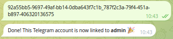

## Введение
Мониторинг позволяет вовремя выявлять проблемы в системе, а оповещения через такие инструменты, как Alertmanager и 
Grafana OnCall, помогают команде быстро реагировать. В статье описано, как связать между собой различные инструменты, 
чтобы инцидент автоматически отслеживался от правила мониторинга до уведомления в мессенджере.

## Преимущества маршрутизации алертов через OnCall
Если слать алерты напрямую из Alertmanager в Telegram, уведомления всегда будут приходить в один и тот же чат или
нескольким людям сразу, что неудобно при сменах дежурств и может привести к потере ответственности — все видят
сообщение, но никто не обязан реагировать. Нет удобного контроля, кто сейчас отвечает, сложно отличить рабочие
часы от нерабочих, невозможно управлять графиком дежурств.

Если же передавать оповещения из Alertmanager в Grafana OnCall, а уже оттуда — в Telegram, появляются важные
преимущества. Grafana OnCall позволяет вести расписание дежурств: вы указываете, кто и когда на смене, и только
этот человек получает уведомление. Также доступна эскалация — если дежурный не отреагировал за определённое время,
алерт пересылается следующему ответственному или целой группе, чтобы инцидент не остался без внимания. Через Grafana
OnCall можно подтвердить получение сообщения ("Acknowledge").

Таким образом, связка Alertmanager → Grafana OnCall → Telegram обеспечивает централизованный, управляемый и
прозрачный процесс реагирования на инциденты, автоматизирует учёт дежурств, поддерживает эскалацию и позволяет
отслеживать подтверждение алертов.

## Общая схема прохождения алерта

### Визуальная схема (диаграмма прохождения алерта)
```
Prometheus Rule → vmalert → Alertmanager → Grafana OnCall → Telegram
```
Эта диаграмма отражает основной путь прохождения алерта — от возникновения события в метриках до получения уведомления
в мессенджере ответственным сотрудником.

## VMAlert: обработка и маршрутизация алертов
### Что такое VMAlert
VMAlert — это компонент стека мониторинга VictoriaMetrics, предназначенный для оценки правил алертинга (alerting rules)
в стиле Prometheus и генерации алертов на их основе. VMAlert берет на вход файл (или список файлов) с alert rule'ами,
периодически опрашивает метрики (как правило, из VictoriaMetrics или Prometheus-compatible источников), вычисляет
выражения и при их срабатывании формирует события алерта. Далее он направляет сформированные алерты в Alertmanager
для дальнейшей маршрутизации и обработки.

### Архитектура решения
В данной архитектуре для мониторинга метрик используется Prometheus-совместимая система — VictoriaMetrics с её 
компонентом vmalert. Сначала создаётся alert rule (правило срабатывания) и применяется 
к vmalert. Как только условие правила выполняется, vmalert формирует алерт и отправляет его в Alertmanager. Alertmanager 
занимается маршрутизацией алертов, их группировкой, устранением дублирования и переадресацией по настройкам. Следующий 
этап — передача алерта из Alertmanager в Grafana OnCall, который уже отвечает за координацию оповещений: учитывает 
расписания дежурных, каналы связи и собственную логику эскалаций. После обработки события в OnCall ответственным 
лицам отправляется уведомление — в нашем случае посредством Telegram.

Такой подход позволяет гибко настроить процесс реагирования на инциденты: алерты по цепочке проходят через все нужные 
этапы фильтрации, маршрутизации и эскалации для быстрого и адресного оповещения нужных сотрудников.

## Установка Kubernetes

Установка kubernetes через terraform
```shell
git clone https://github.com/patsevanton/gitlab-job-labels-to-victorialogs
export YC_FOLDER_ID='ваш folder_id'
terraform init
terraform apply
```

## Установка Prometheus Operator CRDs
Используем Prometheus Operator CRDs потому что еще очень много алертов находится в виде в формате `kind: PrometheusRule`.
```shell
helm repo add prometheus-community https://prometheus-community.github.io/helm-charts
helm repo update
helm upgrade --install --wait prometheus-operator-crds prometheus-community/prometheus-operator-crds --version 20.0.0
```


## Установка OnCall helm чарта
```shell
helm repo add grafana https://grafana.github.io/helm-charts
helm repo update
helm upgrade --install --wait \
    oncall grafana/oncall \
    --namespace oncall --create-namespace \
    --version 1.3.62 \
    --values oncall-values.yaml
```

## Установка victoria-metrics-k8s-stack
Добавим Helm репозиторий и установим VictoriaMetrics stack:
```bash
helm repo add vm https://victoriametrics.github.io/helm-charts/
helm repo update
helm upgrade --install --wait \
    vmks vm/victoria-metrics-k8s-stack \
    --namespace vmks --create-namespace \
    --version 0.46.0 \
    --values vmks-values.yaml
```


### Создадим prometheus rule, которое будет алертить всегда для тестирования цепочки

Для тестирования всей цепочки прохождения алерта, логично начать с самого простого варианта — создать правило, которое
будет алертить всегда, независимо от состояния системы. Это позволит убедиться, что весь процесс — от генерации события
до получения уведомления в Telegram — работает корректно.

Создадим yaml-файл с Prometheus alert rule `always-fire-rule.yaml`:

```yaml
apiVersion: monitoring.coreos.com/v1
kind: PrometheusRule
metadata:
  name: always-fire-rule
  labels:
    prometheus: k8s
    role: alert-rules
spec:
  groups:
    - name: always-fire
      rules:
        - alert: AlwaysFiring
          expr: 1 == 1
          for: 1m
          labels:
            severity: critical
          annotations:
            summary: "Тестовое оповещение: Always firing"
            description: "Это тестовый алерт для проверки прохождения цепочки уведомлений."
```

И применим его
```shell
kubectl apply -f alert-always-fire.yaml
```

Это правило срабатывает всегда, поскольку выражение `1 == 1` всегда истинно. Мы задаём небольшую продолжительность
`for: 1m`, после чего алерт переходит в состояние firing. Внутри правила мы также указываем произвольные метки и
аннотации, которые пригодятся для идентификации тестового оповещения при просмотре в Grafana OnCall или получении
в Telegram.

# Особенность интеграции telegram c oncall
Для работы интеграции telegram c oncall необходимо чтобы oncall был доступен в интернете по HTTPS.
Поэтому в чарте oncall присутствует следующий код:
```yaml
ingress:
  annotations:
    cert-manager.io/issuer: "letsencrypt-prod"
    kubernetes.io/ingress.class: nginx
```

# Установка плагина OnCall
Grafana будет доступна по адресу http://grafana.apatsev.org.ru
Получение пароля grafana для admin юзера
```shell
kubectl get secret vmks-grafana -n vmks -o jsonpath='{.data.admin-password}' | base64 --decode
```

Мне удалось настроить OnCall плагин только через UI. В конце будут приведены разные ошибки при попытке настройке Oncall 
плагина. Итак, для настройки плагина OnCall через UI необходимо:
- Открыть Grafana
- Перейти `Home` -> `Administration` -> `Plugins and data` -> `Grafana OnCall` -> `Configuration`
- Указать адрес oncall: `http://oncall-engine.oncall:8080`
- Нажать connect

### Описание интеграции с Alertmanager

Для интеграции Alertmanager с Grafana OnCall достаточно добавить в конфигурацию Alertmanager соответствующий
получатель (receiver) с webhook-URL, предоставленным Grafana OnCall. Пример части values для victoria-metrics-k8s-stack
выглядит следующим образом, где основной трафик алертов теперь идет в oncall:

```yaml
      - name: 'oncall-webhook'
        webhook_configs:
          - url: 'http://oncall-engine.oncall:8080/integrations/v1/alertmanager/token/'
            send_resolved: true
```

В этом примере создаётся receiver (получатель) с именем `oncall-webhook`, который использует webhook для отправки
алертов напрямую в Grafana OnCall. В URL указывается уникальный путь интеграции и ключ, который можно получить в
настройках Grafana OnCall для вашей службы. Опция `send_resolved` позволяет уведомлять OnCall также о том, что
алерт был устранён.

### Подключение источника алертов
Для интеграции Grafana OnCall c системой мониторинга, построенной на базе Prometheus и VictoriaMetrics, необходимо
корректно связать цепочку генерации и доставки алертов:  
Prometheus генерирует alert согласно заданным правилам и отправляет их в компонент vmalert (часть VictoriaMetrics),
который транслирует эти алерты в Alertmanager. Alertmanager, в свою очередь, выполняет агрегацию, группировку и
маршрутизацию алертов, а затем пересылает их в Grafana OnCall.

Чтобы Alertmanager мог отправлять алерты в Grafana OnCall, нужно в конфигурационный файл Alertmanager (обычно это
`alertmanager.yml`) добавить новый webhook receiver с endpoint, предоставляемым OnCall. Затем, в пользовательском
интерфейсе OnCall, создаётся интеграция типа Alertmanager, где система генерирует URL, на который должны приходить
алерты. Этот адрес и указывается в Alertmanager.

После этого все алерты, направленные на receiver `grafana-oncall`, будут поступать в Grafana OnCall для
дальнейшей обработки.

# Интеграции OnCall и Alertmanager

Необходимо создать integration
В grafana переходим: `Home` -> `Alerts & IRM` -> `OnCall` -> `Integrations`
Создаем `alertmanager` integration с именем `alertmanager-intergration`
Получаем URL для интеграции с внешним адресом:
```
https://oncall.apatsev.org.ru/integrations/v1/alertmanager/token/
```

Этот URL можно переделать с внутренним адресом:
```
http://oncall-engine.oncall:8080/integrations/v1/alertmanager/token/
```
Активируем webhook_configs в файле vmks-values.yaml и запускаем обновление victoria-metrics-k8s-stack
```bash
helm upgrade --install --wait \
    vmks vm/victoria-metrics-k8s-stack \
    --namespace vmks --create-namespace \
    --version 0.46.0 \
    --values vmks-values.yaml
```

Почему-то слетает подключение плагина OnCall. Поэтому подключаем его снова.
- Открываем Grafana
- Перейти `Home` -> `Administration` -> `Plugins and data` -> `Grafana OnCall` -> `Configuration`
- Указать адрес oncall: `http://oncall-engine.oncall:8080`
- Нажать connect

# Настройка расписания дежурств
Переходим в grafana `Home` -> `Alerts & IRM` -> `OnCall` -> `Schedules`
Нажимаем `New schedule` и выбираем `Set up on-call rotation schedule`
Создаем новое расписание дежурств с названием `demo-schedule`
Нажимаем `Add rotation`, выбираем weeks и активируем `Mask by weekdays` и выбираем `Mo`,`Tu`,`We`,`Th`,`Fr`.
Указываем юзера. В данном случае юзер admin.

# Настройка цепочки эскалации
Переходим в grafana: `Home` -> `Alerts & IRM` -> `OnCall` -> `Escalation chains`
Создаем новую цепочку эскалации: `demo-escalation-chain`: `notify users from on-call schedule`.
И выбираем `demo-schedule`.

# Подключение цепочки эскалации к integration:
Переходим в grafana `Home` -> `Alerts & IRM` -> `OnCall` -> `Integrations`
Открываем `alertmanager-intergration`, добавляем route, указываем в шаблоне:
```
{{ payload.commonLabels.severity == "critical" }}
```
Подключаем цепочку эскалации `demo-escalation-chain`.

## Настройка Grafana OnCall для оповещения в Telegram

# Указание telegram token
Если вы активируйте telegram polling и не укажите telegram token, то будут ошибки.
Читаем логи telegram-polling:
```shell
kubectl logs -n oncall -l app.kubernetes.io/component=telegram-polling -c telegram-polling
```
Ошибка:
```
telegram.error.InvalidToken: Invalid token
```

Поэтому прописываем сначала прописываем telegram token в env в oncall-values.yaml либо переходим 
в `Home` -> `Alerts & IRM` -> `OnCall` -> `Settings` в ENV Variable, правим `TELEGRAM_TOKEN`
а затем активируем telegram polling в oncall-values.yaml.


Активируйте telegram polling и обновите Oncall
```shell
helm upgrade --install --wait \
    oncall grafana/oncall \
    --namespace oncall --create-namespace \
    --version 1.3.62 \
    --values oncall-values.yaml
```

### Получение алертов в личных сообщениях Telegram
Чтобы получать нотификации в своих личных сообщениях Telegram и иметь возможность выполнять действия (подтвердить, 
решить, замолчать оповещение) прямо из чата:

- Перейдите в grafana `Home` -> `Alerts & IRM` -> `OnCall` -> `Users`.
- Нажимаем `View my profile`
- Найдите настройку Telegram, нажмите “Connect account”.
- Для автоматического подключения нажмите “Connect automatically”.
- Скопируйте секрет и вставьте в вашем Telegram боте



- В `Default Notifications` и `Important Notifications` укажите Telegram как способ оповещения по умолчанию.


# Aлерт в telegram
Aлерт в telegram выглядит вот так

Вы можете нажать resolve, если починили проблему или можете загрушить алерт.

## Заключение
Интеграция Grafana OnCall с Telegram — это быстрый способ организовать современную командную коммуникацию по 
инцидентам без лишней бюрократии. Grafana OnCall предоставляет централизованную платформу для эффективного 
управления алертами и инцидентами. Простота интеграции с популярными инструментами мониторинга и коммуникационными 
платформами, такими как Telegram, делает этот инструмент очень гибким. Благодаря OnCall команда может не переживать 
о том, что важные события останутся без внимания — каждый инцидент быстро доходит до ответственного человека. 
Интерфейс OnCall интуитивно понятен, а масштабирование и поддержка настроек пользователей позволяют оптимизировать 
рабочие процессы под каждую команду.


